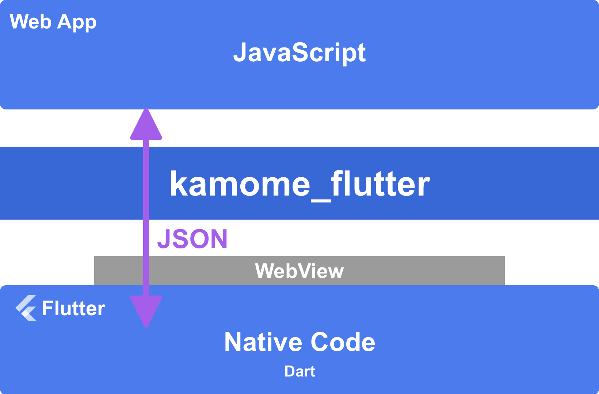

# kamome_flutter

kamome_flutter is a plugin for Flutter apps using the WebView. This plugin bridges a gap between JavaScript in the WebView and the native code written
in Dart.



**[NOTE]**
kamome_flutter requires the WebView plugin such as [flutter_inappwebview](https://pub.dev/packages/flutter_inappwebview)(recommended), [webview_flutter](https://pub.dev/packages/webview_flutter), and [webview_flutter_plus](https://pub.dev/packages/webview_flutter_plus).

## Include Library in Your Project

### 1. Flutter

See [Installing](https://pub.dev/packages/kamome_flutter/install).

### 2. JavaScript

#### npm

1. npm install
	
	```
	npm install kamome
	```

1. Write following import statement in JavaScript
	
	```javascript
	import { KM } from "kamome"
	```

#### Manual Installation

If you manually install the JavaScript library, see [this page](https://github.com/HituziANDO/kamome#manual-installation).

## Usage

### Send a message from the JS code to the Dart code

1. Send a message from the JavaScript code
	
	```javascript
	// JavaScript

	import { KM } from "kamome"

	// Uses async/await.
	try {
	    // Sends `echo` command.
	    const result = await KM.send('echo', { message: 'Hello' });
	    // Receives a result from the native code if succeeded.
	    console.log(result.message);
	} catch(error) {
	    // Receives an error from the native code if failed.
	    console.log(error);
	}
	```

1. Receive a message on Flutter using [flutter_inappwebview](https://pub.dev/packages/flutter_inappwebview)

	Implement the JavaScriptRunner for flutter_inappwebview.
	
	```dart
	// Dart

	class _InAppWebViewJavaScriptRunner implements JavaScriptRunner {
	  final InAppWebViewController _controller;

	  _InAppWebViewJavaScriptRunner(this._controller);

	  @override
	  void runJavaScript(String js) async {
	    await _controller.evaluateJavascript(source: js);
	  }
	}
	```

	Build a WebView widget using flutter_inappwebview.

	```dart
	// Dart

	// Using flutter_inappwebview plugin.
	class InAppWebViewPage extends StatefulWidget {
	  const InAppWebViewPage({Key? key}) : super(key: key);

	  @override
	  InAppWebViewPageState createState() => InAppWebViewPageState();
	}

	class InAppWebViewPageState extends State<InAppWebViewPage> {
	  late KamomeClient _client;

	  @override
	  void initState() {
	    super.initState();
	  }

	  @override
	  Widget build(BuildContext context) {
	    return Scaffold(
	      appBar: AppBar(
	        title: const Text('Sample'),
	      ),
	      body: Column(
	        children: [
	          Expanded(
	            child: InAppWebView(
	              initialFile: 'assets/index.html',
	              onWebViewCreated: (InAppWebViewController controller) {
	                // Creates the Client object.
	                _client = KamomeClient(_InAppWebViewJavaScriptRunner(controller));
	                _client
	                  ..add(Command('echo', (commandName, data, completion) {
	                    // Received `echo` command.
	                    // Then sends resolved result to the JavaScript callback function.
	                    completion.resolve(data: {
	                      'message': data!['message'],
	                    });
	                    // Or, sends rejected result if failed.
	                    //completion.reject(errorMessage: 'Echo Error!');
	                  }));

	                // Adds the JS handler of Kamome plugin.
	                // Copy following code to yours.
	                controller.addJavaScriptHandler(
	                  handlerName: KamomeClient.apiName,
	                  callback: (args) {
	                    _client.onMessageReceived(args[0]);
	                  });
	              },
	            ),	// InAppWebView
	          )	// Expanded
	        ],
	      ),	// Column
	    );	// Scaffold
	  }
	}
	```

### Send a message from the Dart code to the JS code

1. Send a message from the Dart code on Flutter

	```dart
	// Dart

	// Sends a data to the JS code.
	_client.send('greeting', data: {
	  'greeting': 'Hello! by InAppWebView'
	}, callback: (commandName, result, error) {
	  // Received a result from the JS code.
	  print(result);
	});
	```

1. Receive a message on the JavaScript code

	```javascript
	// JavaScript

	// Adds a receiver that receives a message sent by the native client.
	KM.addReceiver('greeting', (data, resolve, reject) => {
	    // The data is the object sent by the native client.
	    console.log(data.greeting);

	    // Runs asynchronous something to do...
	    setTimeout(() => {

	        // Returns a result as any object or null to the native client.
	        resolve('OK!');
	        // If the task is failed, call `reject()` function.
	        //reject('Error message');
	    }, 1000);
	});
	```

## Configuration

### JavaScript configuration

See [this page](https://github.com/HituziANDO/kamome#configuration).

## Browser Alone

When there is no kamome_flutter client, that is, when you run with a browser alone, you can register the processing of each command.

```javascript
// JavaScript

KM.browser
    .addCommand("echo", function (data, resolve, reject) {
        // Received `echo` command.
        // Then sends resolved result to the JavaScript callback function.
        resolve({ message: data["message"] });
        // Or, sends rejected result if failed.
        //reject("Echo Error!");
    });
```
